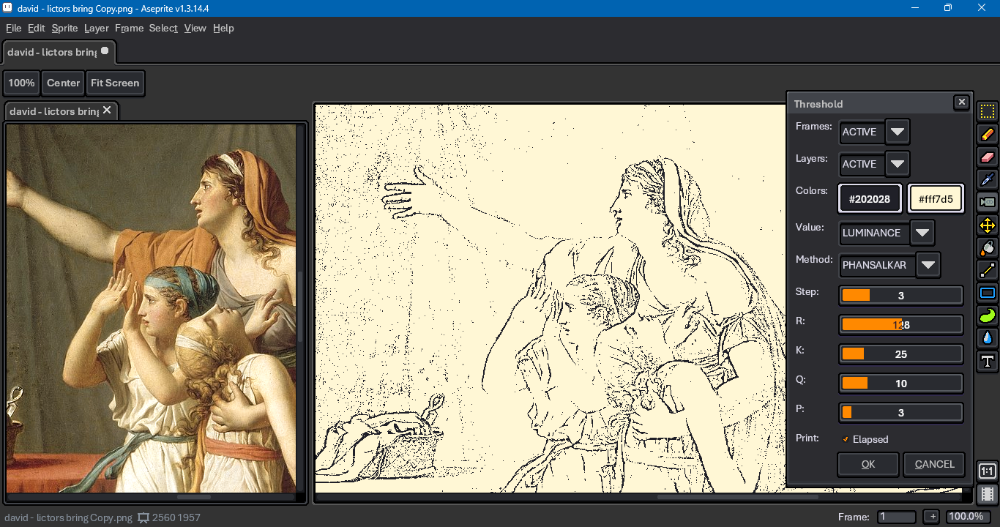
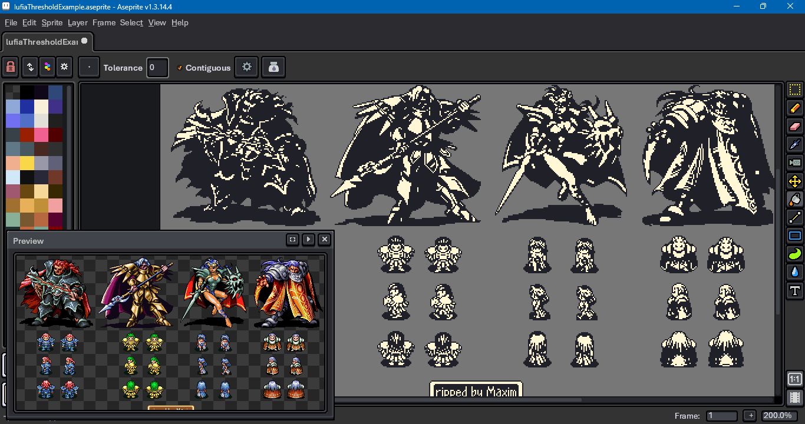
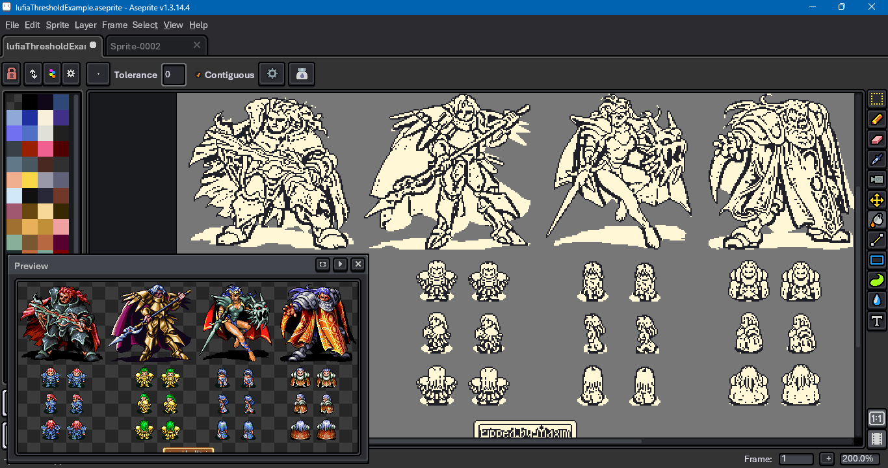
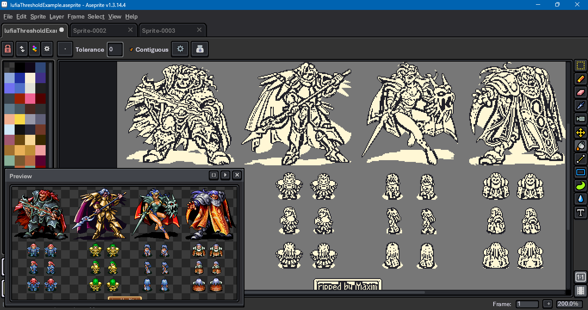

# Aseprite Threshold Filter

This is a [threshold filter](https://en.wikipedia.org/wiki/Thresholding_(image_processing)) for use with the [Aseprite](https://www.aseprite.org/) [scripting API](https://github.com/aseprite/api). (The screen shot above uses David's [_The Lictors Bring to Brutus the Bodies of His Sons_](https://en.wikipedia.org/wiki/The_Lictors_Bring_to_Brutus_the_Bodies_of_His_Sons) as a test image.)

## Download

To download this script, click on the green Code button above, then select Download Zip. You can also copy and paste the contents of the `threshold.lua` file. Be sure to click on the Raw file button before copying; do not copy the formatted code. Beware that some browsers will append a `.txt` file format extension to script files on download. Aseprite will not recognize the script until this is removed and the original `.lua` extension is used. 

## Usage

To use this script, open Aseprite. In the menu bar, go to `File > Scripts > Open Scripts Folder`. Move the Lua script into the folder that opens. Return to Aseprite; go to `File > Scripts > Rescan Scripts Folder`. The script should now be listed under `File > Scripts`. Select `threshold.lua` to launch the dialog.

If an error message in Aseprite's console appears, check if the script folder is on a file path that includes characters beyond ASCII, such as 'é' (e acute) or 'ö' (o umlaut).

A hot key can be assigned to the script by going to `Edit > Keyboard Shortcuts`. The search input box in the top left of the shortcuts dialog can be used to locate the script by its file name.

The script edits [cel](https://aseprite.org/docs/cel) images in place. It allows you to target the `"ACTIVE"` [frame](https://aseprite.org/docs/animation/) or [layer](https://aseprite.org/docs/layers), `"ALL"` frames or layers, or those within a [timeline](https://aseprite.org/docs/timeline) `"RANGE"`. The timeline must be visible for the [range](https://aseprite.org/docs/range) target to work. The script excludes locked and hidden layers, reference layers and tile map layers. It ignores [group](https://aseprite.org/docs/layer-group/) layers within a range. It seeks out children layers for the active and all targets.

The script only works for sprites in RGB [color mode](https://aseprite.org/docs/color-mode). To convert an RGB color to a grayscale value, the script offers the following formulae:

* `"AVERAGE"`: (r + g + b) / 3
* `"LUMINANCE"`: (r * 30 + g * 59 + b * 11) / 100
* `"MAX"`: max(r, g, b)
* `"MID_RANGE"`: (max(r, g, b) + min(r, g, b)) / 2

The average algorithm is used to calculate the intensity in the HSI color representation. Maximum is the algorithm used for the value in HSV. Mid-range is for the lightness in HSL. See the Wikipedia entry on [HSL and HSV](https://en.wikipedia.org/wiki/HSL_and_HSV) for more. The luminance calculation, a weighted average, is based on CSS and SVG [blending modes](https://www.w3.org/TR/compositing-1/#blendingnonseparable).

In local thresholding algorithms -- Sauvola and Phansalkar -- the step determines the size of the pixel neighborhood. For example, a step of 3 yields a neighborhood of 3 * 2 + 1, or 7.

## Acknowledgments & References

The series of blog posts from Craft of Coding on the [Bernsen](https://craftofcoding.wordpress.com/2021/10/27/thresholding-algorithms-bernsen-local/), [Niblack](https://craftofcoding.wordpress.com/2021/09/30/thresholding-algorithms-niblack-local/), [Sauvola](https://craftofcoding.wordpress.com/2021/10/06/thresholding-algorithms-sauvola-local/) and [Phansalkar](https://craftofcoding.wordpress.com/2021/09/28/thresholding-algorithms-phansalkar-local/) algorithms were of great use in creating the Lua implementation.

## Examples

Below is an example of the filter's various algorithms at work on a pixel art image. The sprites are from _Lufia II: Rise of the Sinistrals_, as posted on [The Spriter's Resource](https://www.spriters-resource.com/snes/lufia2/sheet/38397/).

Global

Sauvola

Phansalkar

🇹🇼 🇺🇦